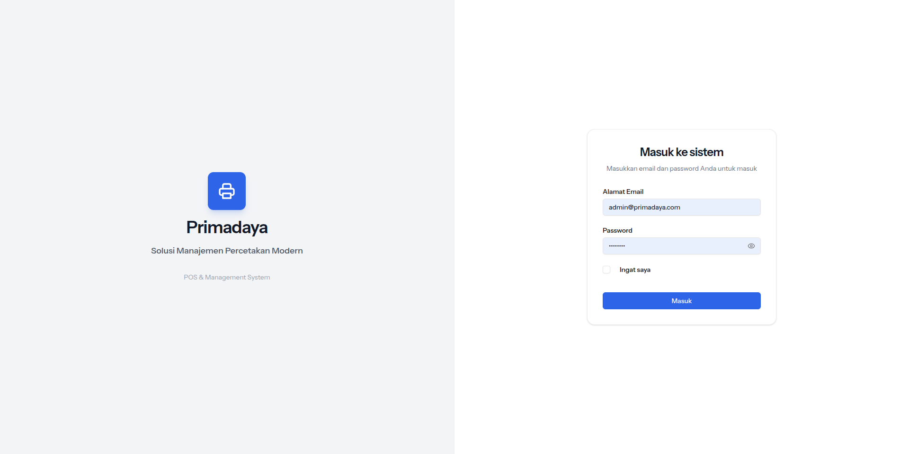
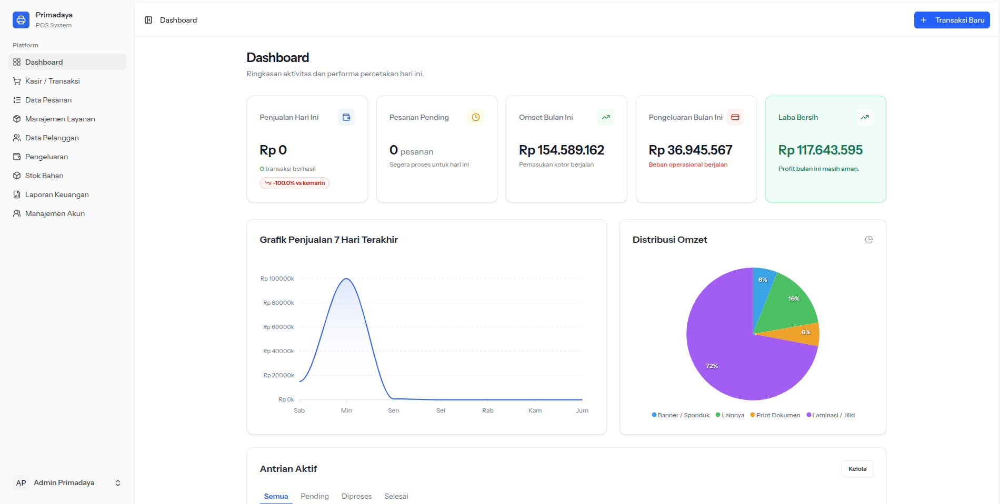
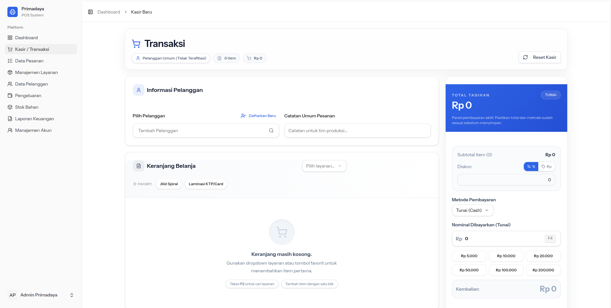
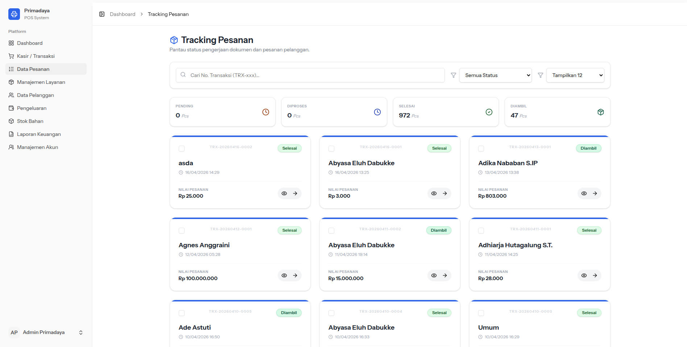
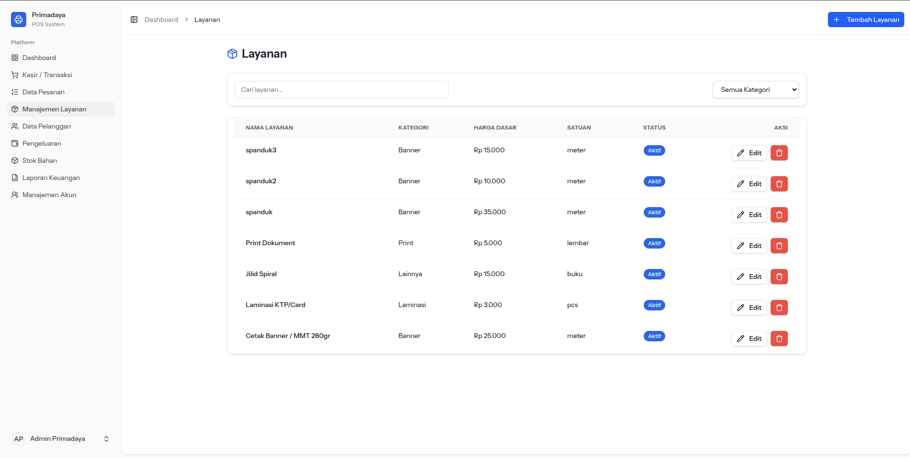
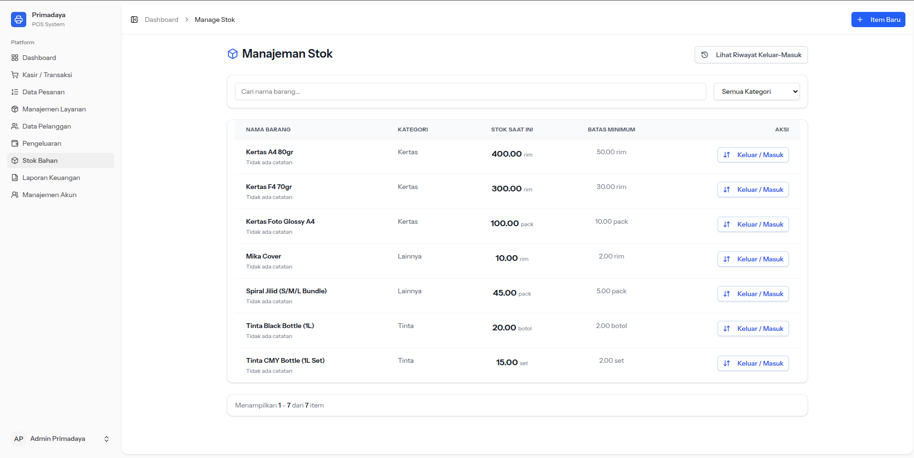
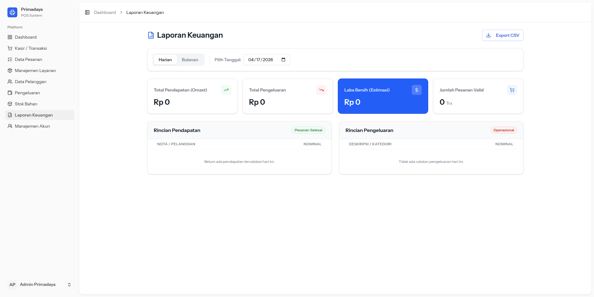
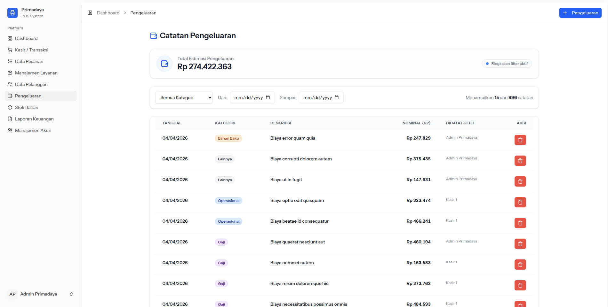
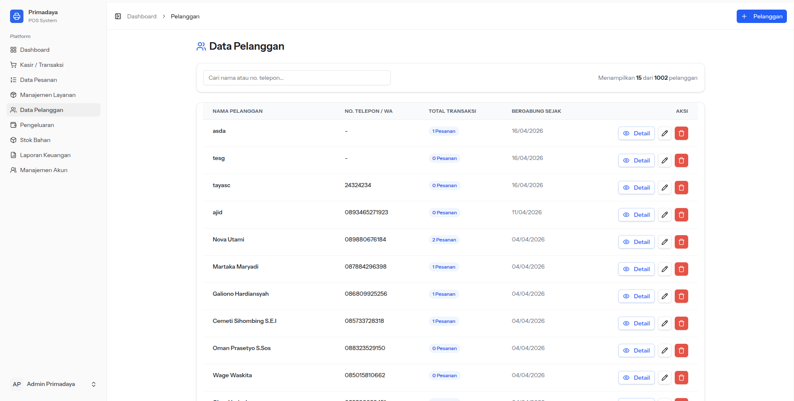
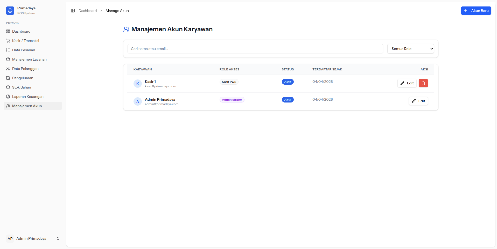

# AppPrimadaya 🖨️
**Point of Sale (POS), Order Management, and Internal Business Automation** built for Primadaya Print (Printing/Digital Print Shop).

Streamline cashier operations, track printing orders, manage stock, and generate financial reports with a premium Vue 3 SPA frontend and robust Laravel backend.

## Tech Stack 🛠️
- **Backend**: Laravel (PHP)
- **Frontend**: Vue 3 + Inertia.js (Single Page Application architecture with server-side routing)
- **Styling**: TailwindCSS + Shadcn-vue (Premium, professional UI)
- **Icons**: Lucide Vue / Radix Icons
- **Database**: MySQL

## Core Modules & Features ✨

### 1. POS / Cashier
- **Matrix Pricing**: Dynamic pricing based on **Paper Size** (A4, F4, A3) and **Print Type** (Color, BW).
- **Inline Customer**: Cashiers can register new customers directly from the checkout page.
- **Shortcuts**: Optimized for speed with keyboard shortcuts (`F2`: Search, `F4`: Pay, `F9`: Save).
- **Pinned Services**: Frequently used services can be "pinned" for quick one-click access.

### 2. Order Lifecycle
- **Statuses**: `Pending` → `Diproses` → `Selesai` (Ready) → `Diambil` (Picked up).
- **Payment**: Supports `Cash`, `QRIS`, and `Transfer`.
- **Receipts**: Support for 80mm POS Thermal printers and standard A4 PDF invoices.

### 3. Stock & Inventory
- Tracks raw materials (reams of paper, ink bottles, etc.).
- Logs stock ins/outs linked to transactions or manual adjustments.

### 4. Security & Roles (RBAC)
- **Admin**: Full access (Reports, Staff management, Service editing).
- **Kasir**: Limited to POS, Customer management, and viewing services.

---

## 📸 Screenshots

### 🔑 Login Page


### 📊 Dashboard Admin


### 🛒 Kasir / POS (Point of Sales)


### 📦 Data Pesanan (Order Lifecycle)


### 🛠️ Manajemen Layanan & Jasa


### 📋 Manajemen Stok Bahan Baku


### 💰 Laporan Keuangan


### 💸 Pengeluaran & Beban


### 👥 Data Pelanggan


### 🛡️ Manajemen Akun & Staff


---

## Getting Started 🚀

### Prerequisites
- PHP 8.3+
- Node.js 22+
- MySQL / MariaDB
- Composer

### Installation
1. Clone the repository
```bash
git clone https://github.com/NvlFR/AppPrimadaya.git
cd AppPrimadaya
```

2. Install PHP Dependencies
```bash
composer install
```

3. Install Node.js Dependencies
```bash
npm install
```

4. Setup Environment
```bash
cp .env.example .env
php artisan key:generate
```
*(Configure your database credentials in the `.env` file)*

5. Run Migrations & Seeders
```bash
php artisan migrate --seed
```

6. Serve the Application
```bash
# Terminal 1 - Laravel Server
php artisan serve

# Terminal 2 - Vite Dev Server
npm run dev
```

Visit `http://localhost:8000` in your browser.

## Contributing
Developer guidelines and architectural context can be found in [`AGENTS.md`](AGENTS.md).
